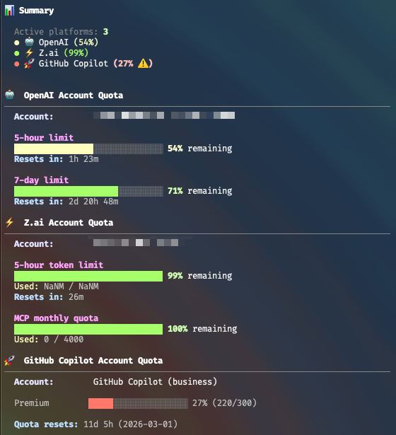

# opencode-mystatus-cli

This is a fork of [opencode-mystatus](https://github.com/vbgate/opencode-mystatus) that adds a new terminal mode and is otherwise identical.



## Usage

For usage inside opencode, see the original repository.

### Standalone Usage

You can run mystatus directly from the terminal:

```bash
# Install dependencies first (if not already installed)
npm install

# Single run - check quotas once
npm run mystatus

# Watch mode - continuously monitor quotas (updates every 5 minutes)
npm run mystatus:watch

# Watch mode with 1-minute updates (for testing/rapid monitoring)
npm run mystatus:watch:fast

# Watch mode with custom interval (e.g., every 10 minutes)
npm run mystatus -- --watch --interval 10
```

**Command Line Options:**
- `-w, --watch` - Enable watch mode for continuous monitoring
- `-i, --interval <minutes>` - Set polling interval in minutes (default: 5)

**Watch Mode Features:**
- 🔄 Automatically refreshes quota data at specified intervals
- ⏱️ Shows live countdown to next update
- 📊 Beautiful dashboard with color-coded health indicators
- 🎯 Press Ctrl+C to exit gracefully

Or if you prefer using Bun:

```bash
bun install
bun run cli.ts
```

## License

MIT
